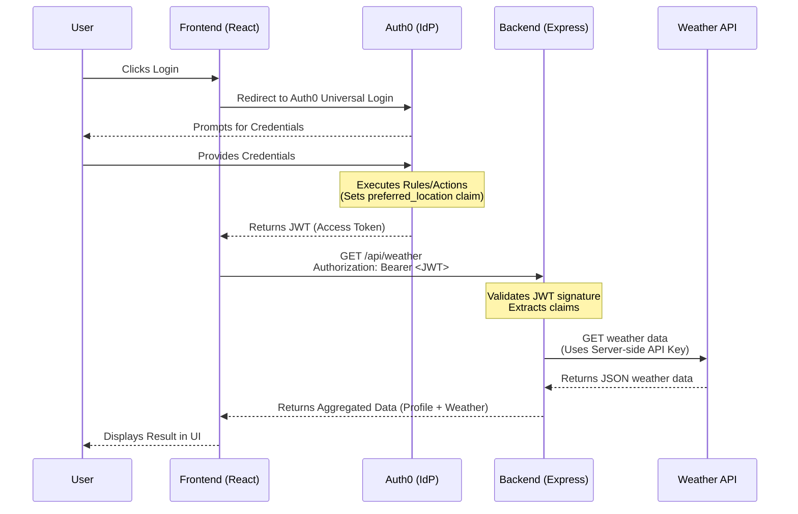

<div align="center">
  
</div>

# Context-Preserving Assistant - Auth0 Minimal Scaffold

🚀 **Live Deployment Links:**
- **Frontend**: [https://context-preserving-assistant.vercel.app/](https://context-preserving-assistant.vercel.app/)
- **Backend API**: [https://localhost:3000/](https://localhost:3000/)

This repository contains a minimal scaffold for a full-stack personal assistant that demonstrates:

- User authentication using Auth0 Universal Login (frontend)
- A first-party API secured by Auth0 access tokens (backend `/api/profile`)
- A third-party weather API call made from the backend using a server-side secret (simulated Token Vault)
- An example demo endpoint that references a user-specific setting then calls the weather API

This is a starter/mentorship scaffold — follow the steps below to configure Auth0 and run the demo.

## Layout

- `backend/` - Express API
- `frontend/` - React app using `@auth0/auth0-react`

## System Architecture

The following diagram illustrates the authentication and data flow of the Context-Preserving Assistant:



## Quickstart

1. Create an Auth0 Application (Single Page Application) and an API in the Auth0 dashboard:
   - Note your Auth0 Domain, Client ID, and API Audience.
   - In the API, add an identifier (this becomes `AUTH0_AUDIENCE`).
   - Add an application callback URL (e.g., `http://localhost:3000`).
   - Add `http://localhost:3000` to Allowed Web Origins and Allowed Logout URLs.
   - In the API settings, add a `read:profile` or similar scope if you want to extend the demo later.

2. Add the following Auth0 Rule or Action to enrich tokens with a custom user setting (preferred location):
   - This example adds `https://example.com/preferred_location` to the ID/access token.
   - In the Auth0 Dashboard, go to Actions → Flows → Login, then add a custom action with this logic:
     ```js
     exports.onExecutePostLogin = async (event, api) => {
       api.accessToken.setCustomClaim('https://example.com/preferred_location', 'London');
     };
     ```
   - Replace `'London'` with the user-specific location you want to preserve in the session.

3. Create an OpenWeatherMap API key (or another weather provider) and note it.

3. Copy env examples and fill values:

Backend:
```
cd backend
cp .env.example .env
# edit .env and fill AUTH0_DOMAIN, AUTH0_AUDIENCE, AUTH0_JWKS_URI, OPENWEATHER_API_KEY
```

Frontend:
```
cd frontend
cp .env.example .env
# edit .env to set REACT_APP_AUTH0_DOMAIN, REACT_APP_AUTH0_CLIENT_ID, REACT_APP_AUTH0_AUDIENCE
```

4. Install and run

Backend:
```powershell
cd backend
npm install
npm start
```

Frontend:
```powershell
cd frontend
npm install
npm start
```

5. Open `http://localhost:3000`, log in via Auth0, then click the demo buttons to call the protected first-party API and the weather endpoint. The frontend fetches an access token using the logged-in user session and sends it to the backend; the backend validates the token and then calls the weather provider using the server-side API key (simulated Token Vault).

6. To validate the backend service quickly, start the backend server and run:
```powershell
cd backend
npm test
```

## Notes & Next steps

- This scaffold uses environment variables to simulate a Token Vault for the weather provider. For production, store third-party keys in a real vault (HashiCorp Vault, Azure Key Vault, AWS Secrets Manager).
- To demonstrate full delegated access to third-party APIs that accept OAuth2 delegated tokens, implement an on-behalf-of flow or a token exchange per the provider's docs.
